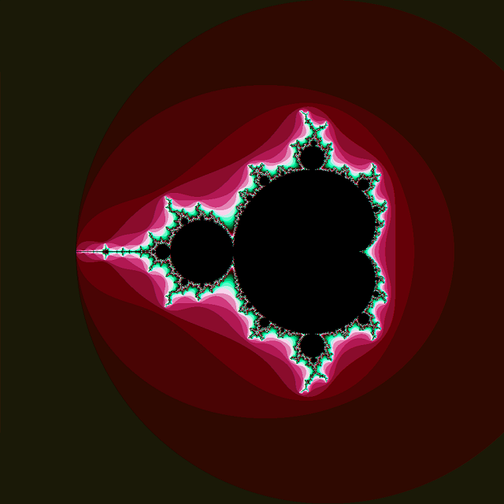
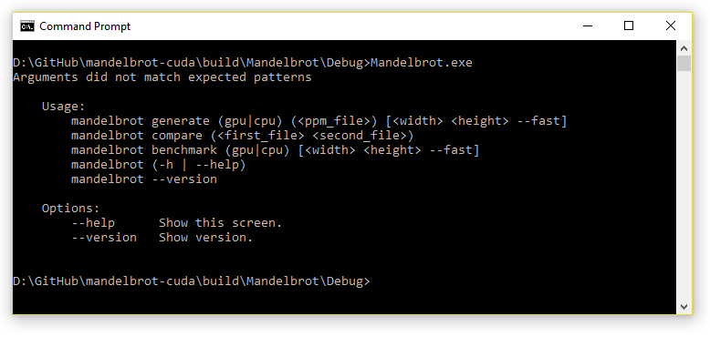

# Mandelbrot CUDA

A C++ application to generate Mandelbrot image with different sizes. Provide support to benchmark on different devices and enable flags for optimisations. Extra feature to compare the resulted image between for different configurations.

## Introduction

A GPU implementation using CUDA to generate the mandelbrot set. Provided an alternative aproach for CPU with SIMD instructions and multithreading support using OpenMP. The Mandelbrot algorithm is a very good use case for testing the power of GPU for parallel work jobs. Due to its design, each pixel can be computed individually without depending on other data.

## Requirements

- CMake v3.2 – generate project files
- Visual Studio 14 – development environment
- CUDA 8.0 – execute programs on GPU
- Docopt – library to create a user command line support for the application
- VC++ v19 – compiler with C++ 11 features

## How To

The application is able to accept different command line arguments in order to execute different code behaviors. The command line parsing is implemented using Docopt library which allows the developer to define an interface of command patterns and make the code behave according to the user input.

The following list shows the command arguments available to the user:

-	**generate cpu output_file width height** – Generates the Mandelbrot image using the original implementation of the algorithm. The command can be switched to use the optimised version by appending the --fast flag.
-	**generate gpu output_file width height** - Generates the Mandelbrot image using the CUDA implementation of the algorithm. 
-	**compare first_image second_image** - Compares two PPM images and tells if they are the same or different.
-	**benchmark cpu width height** - Executes the Mandelbrot algorithm using the original implementation for a subset of images starting from the given size. The command can be switched to use the optimised version by appending the --fast flag. 
-	**benchmark gpu width height** - Executes the Mandelbrot algorithms using the CUDA implementation for a subset of images starting from the given size.

## Screenshots

Screenshot 1

Screenshot 2

